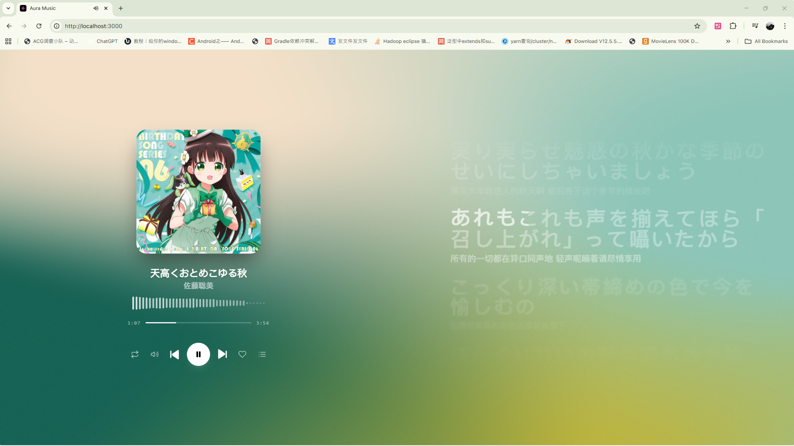
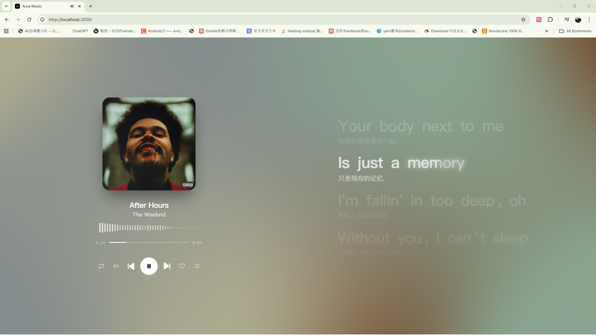
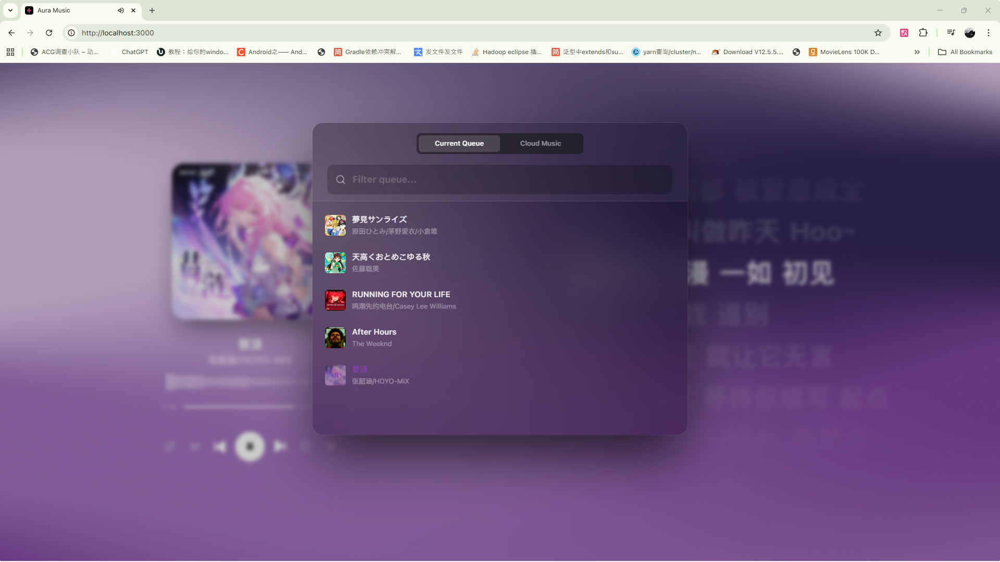
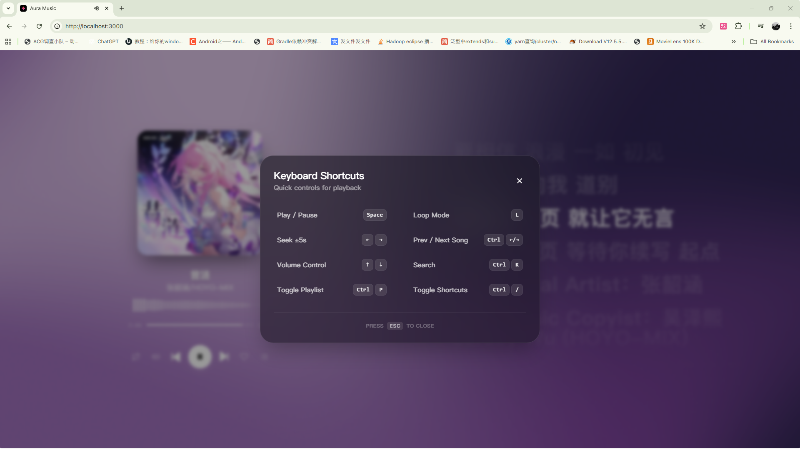

# Aura Music Fork
- Add music sync functionality, sync playlist & play/pause across devices

## Feature

- [x] **WebGL Fluid Background**: Implements a dynamic fluid background effect using WebGL shaders. [Reference](https://www.shadertoy.com/view/wdyczG)
- [x] **Canvas Lyric Rendering**: High-performance, custom-drawn lyric visualization on HTML5 Canvas.
- [x] **Music Import & Search**: Seamlessly search and import music from external providers or local files.
- [x] **Audio Manipulation**: Real-time control over playback speed and pitch shifting.
- [x] **Music Sync**: Real-time sync of playlist & play/pause across devices

## Run Locally

**Prerequisites:** Node.js

1. Install dependencies:
   `npm install`

2. Run backend:
```shell
cd aura-music\backend
pip install -r requirements.txt
uvicorn app.main:app --reload --host 0.0.0.0 --port 8000
```

3. Run frontend:
```shell
cd aura-music
npm install
npm run dev
```

## Screenshot






> Shader source: https://www.shadertoy.com/view/wdyczG

> Vibe coding with gemini3-pro, gpt-5.1-codex-mini, and claude-sonnet-4.5. The first version only took 10 mins.
