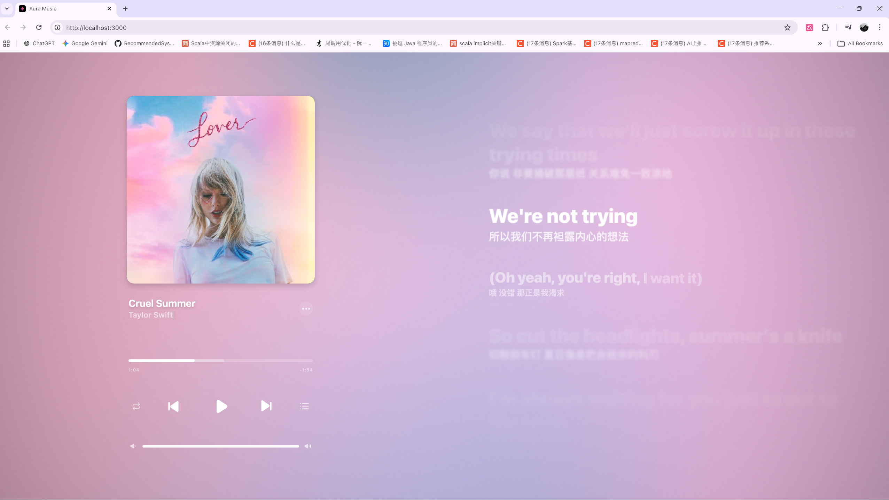
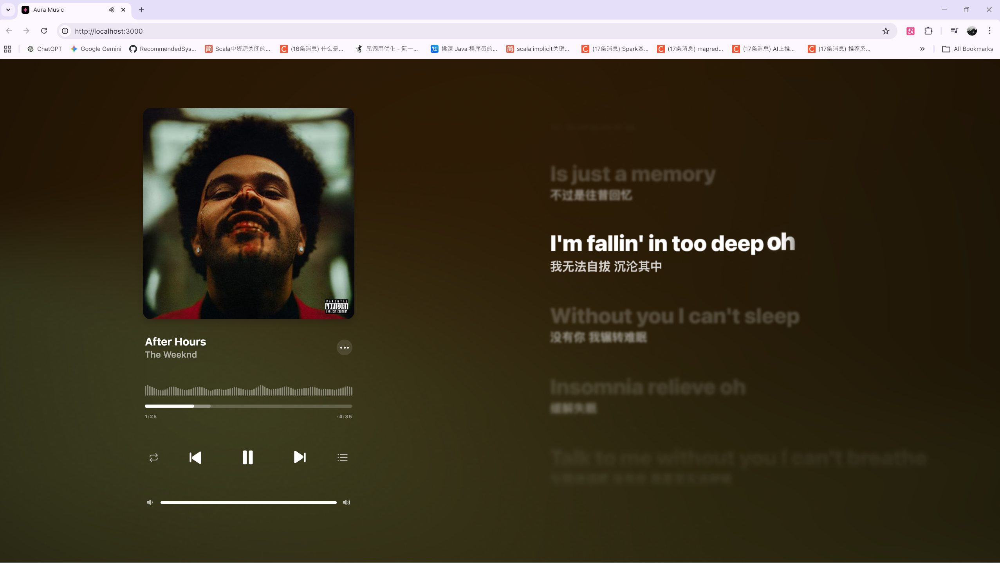
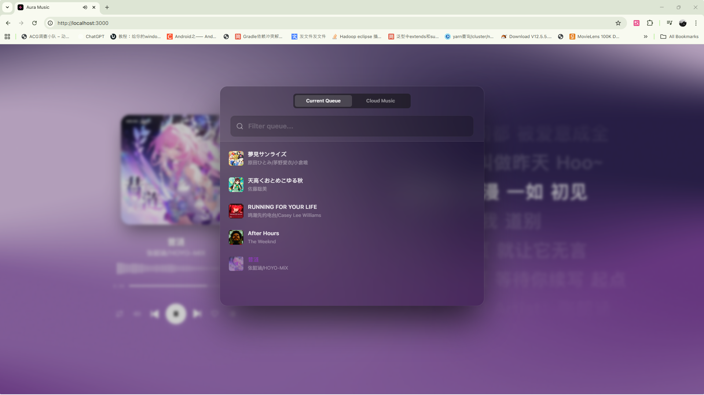
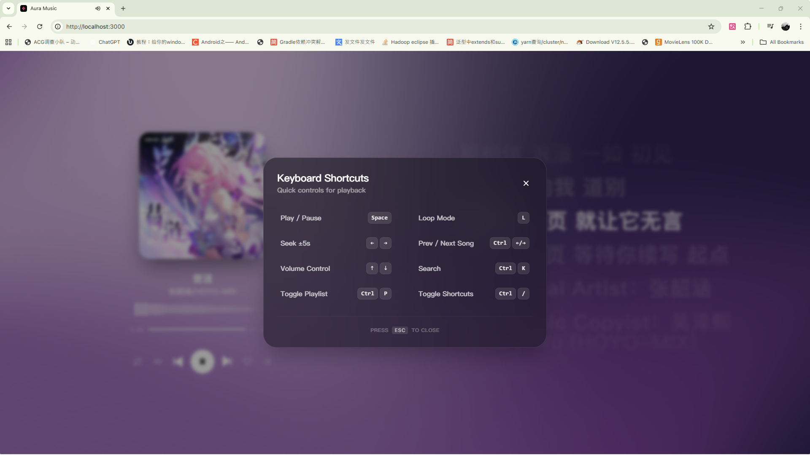

# Aura Music Fork
- Add music sync functionality, sync playlist & play/pause across devices

## Feature

- [x] **WebGL Fluid Background**: Implements a dynamic fluid background effect using WebGL shaders. [Reference](https://www.shadertoy.com/view/wdyczG)
- [x] **Canvas Lyric Rendering**: High-performance, custom-drawn lyric visualization on HTML5 Canvas.
- [x] **Music Import & Search**: Seamlessly search and import music from external providers or local files.
- [x] **Audio Manipulation**: Real-time control over playback speed and pitch shifting.
- [x] **Music Sync**: Real-time sync of playlist & play/pause across devices

## Run Locally

**Prerequisites:** Node.js, Python

1. Run backend:
```shell
cd aura-music\backend
pip install -r requirements.txt
uvicorn app.main:app --reload --host 0.0.0.0 --port 5237
```

2. Run frontend:
```shell
cd aura-music
npm install
npm run dev
```

3. Enter a room
Enter the same room from multiple devices:
`http://<your-ip-or-domain>:3000/?room=xxx`

## Docker Deployment

The image builds the frontend and serves the built SPA straight from the FastAPI
backend — one container, one port, no reverse proxy required.

```shell
docker compose up -d --build
```

Or without compose:

```shell
docker build -t aura-music .
docker run -d --name aura-music -p 5237:5237 \
  -e AURA_JWT_SECRET=<your-secret> \
  -v aura-data:/srv/aura/backend/data \
  aura-music
```

- Open `http://<host>:5237/?room=xxx` on every device.
- The SQLite database and uploaded media persist in the `aura-data` volume
  (swap it for a bind mount to `/srv/aura/backend/data` if you prefer).
- Set a strong `AURA_JWT_SECRET` (it signs auth cookies) and point
  `AURA_CORS_ORIGINS` at your origins only when hosting the SPA separately.
- Logins last 30 days by default: a short-lived access token (`AURA_ACCESS_TOKEN_MINUTES`,
  30) is renewed silently from a long-lived refresh token (`AURA_REFRESH_TOKEN_DAYS`, 30).

## Screenshot






> Shader source: https://www.shadertoy.com/view/wdyczG

> Vibe coding with gemini3-pro, gpt-5.1-codex-mini, and claude-sonnet-4.5. The first version only took 10 mins.
